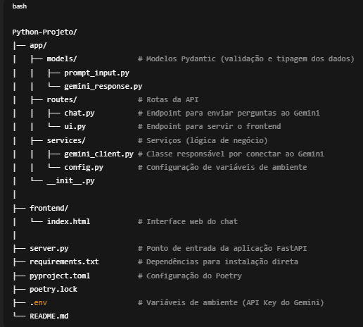

# FastAPI Gemini API

🚀 API FastAPI + Google Gemini

**⚙️ Tecnologias utilizadas** \
- FastAPI
 → Framework web moderno e rápido para criação de APIs em Python.

- Pydantic
 → Validação e tipagem dos dados recebidos pela API.

- Uvicorn
 → Servidor ASGI leve e rápido para rodar a aplicação FastAPI.

- Poetry
 → Gerenciador de dependências e ambiente virtual.

- Google Generative AI SDK
 → Biblioteca oficial para integração com o modelo Gemini.

- python-dotenv
 → Carrega variáveis de ambiente do arquivo .env.

📦 Instalação 
1. Clone o repositório
git clone https://github.com/seu-usuario/Python-Projeto.git
cd Python-Projeto 

2. Configuração de ambiente:

Crie um arquivo .env na raiz com a sua chave da API do Google Gemini:

GOOGLE_API_KEY="sua-chave-aqui"

3. Instale as dependências

Com Poetry:

poetry install

Ou com pip usando o requirements.txt:

pip install -r requirements.txt

▶️ Executando a aplicação

Com Poetry:
poetry run uvicorn server:app --reload

Teste para retornar com pytest: 
no terminal escreva: 

- pytest tests/test_chat.py -v -s -W ignore::pytest.PytestConfigWarning 
Acesse no navegador:
👉 http://127.0.0.1:8000/ (frontend do chat)
📘 Swagger UI

URL: 👉 http://127.0.0.1:8000/docs

- Interface mais popular, permite testar as rotas de forma rápida.

- Tem suporte a autenticação, exemplos de requisição e resposta.

- Usa a biblioteca Swagger UI por baixo dos panos.

📕 ReDoc

URL: 👉 http://127.0.0.1:8000/redoc

- Outra forma de visualizar a documentação, mais limpa e organizada.

- Ideal para consultar a especificação da API (melhor leitura, pior para testar).

- Usa a biblioteca ReDoc.

**Diferença prática**

/docs → Melhor para desenvolvedores testarem os endpoints.

/redoc → Melhor para documentação oficial da API, quando você quer entregar algo bonito e navegável para outras pessoas.
📡 Endpoints principais
POST /chat/ask

Envia um prompt para o Google Gemini e retorna a resposta.

**Exemplo de body JSON:**
- {
  "prompt": "Qual é a capital do Brasil?"
} 
 

- Resposta: 

- {
  "output": "A capital do Brasil é Brasília."
}

**🖥️ Frontend** \
_Localizado em frontend/index.html._ \
o que foi feito:

- Faz requisições via fetch para /chat/ask.

- Interface simples com textarea para prompt e div para exibir a resposta.
- 

**📌 Observações importantes**

Certifique-se de ter o arquivo .env configurado com a sua chave Google Gemini API Key.

O projeto foi estruturado em camadas:

- Models → Entrada/saída de dados (Pydantic).

- Services → Conexão com Gemini e lógica de negócio.

- Routes → Endpoints da API.

- Frontend → Interface de usuário.

As rotas ficam acessíveis em /chat/ask (API) e / (UI).
